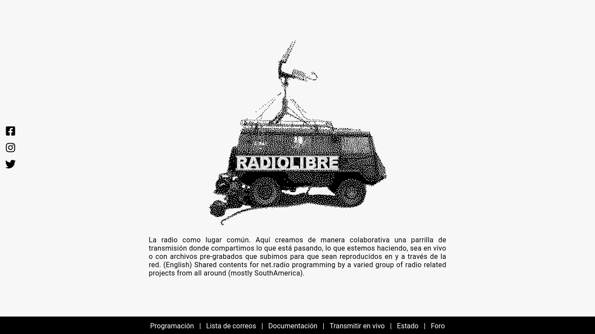

# Web Templates

## radiolibre.altred.xyz

The live site and player for [radiolibre.altred.xyz](https://radiolibre.altred.xyz/).
Static files, no build step. See [its README](./radiolibre.altred.xyz/README.md)
for deployment and for the Icecast quirks the player works around.

## iscream — reporta.altred.xyz

iScream, the Sistema de Alerta Temprana de Radiolibre: up to 8 people go on air
at once from a phone browser (`/reporta.mp3` … `/reporta8.mp3`), plus a
`#radiolibre` chat on a self-hosted Ergo IRC server. Nothing is recorded. See
[its README](./iscream/README.md).

## Radiolibre (2020 template)

The original `radiolibre.cc` template. Kept for reference — its player points at
`live.radiolibre.cc`, which no longer resolves.

## altred.xyz

Moved to its own private repository, `alejoduque/altred.xyz` (history kept).
